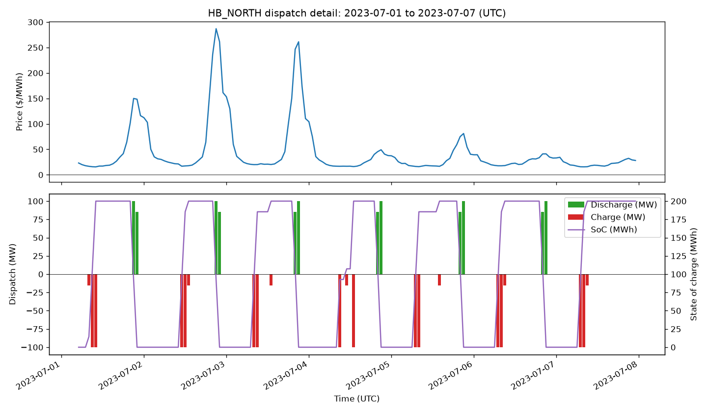
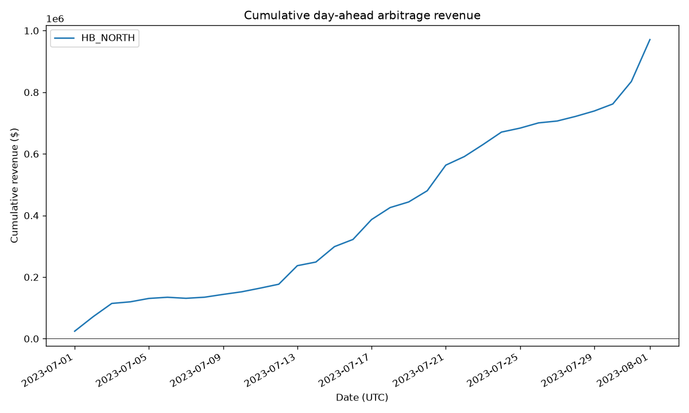
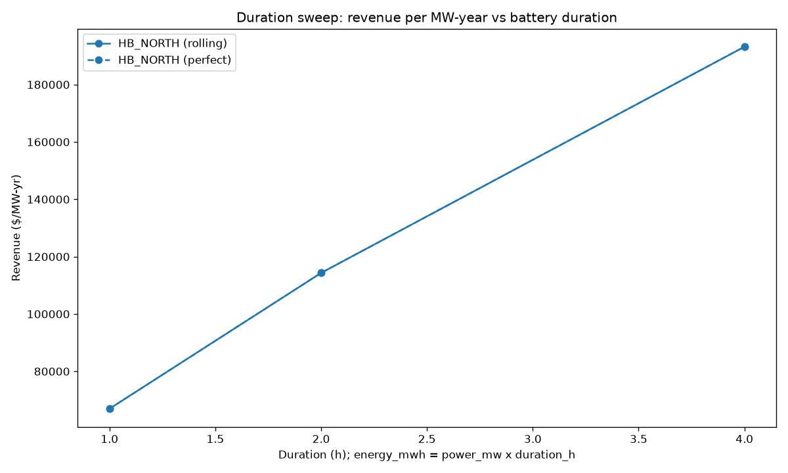

# bess-optimizer

Perfect-foresight battery energy arbitrage on ERCOT day-ahead hub prices:
ingest historical prices, solve a linear program for the revenue-maximizing
charge/discharge schedule under real battery constraints, backtest over
2023-2024, and plot the results. Python core first; a Rust engine (PyO3) drops
in behind the same frozen interfaces in a later milestone.

## Scope note (read this before quoting numbers)

This model captures day-ahead energy arbitrage, and, optionally, ancillary-
service (AS) capacity co-optimization (Regulation Up/Down, RRS, ECRS,
Non-Spin), both under perfect foresight. Neither number alone is the honest
one: energy-only arbitrage understates total ERCOT BESS revenue (in recent
years the majority of real ERCOT battery revenue has come from ancillary
services, not energy arbitrage), while the AS co-optimized number overstates
it (capacity payments only: no deployment energy, no performance or mileage
payments, no failure-to-provide risk, and a price-taker assumption that our
own bids never move the clearing price; see "Modeling assumptions" below).
The honest number for a real operator lies between the energy-only and
co-optimized totals. Real operators also lack perfect foresight; the rolling-
horizon mode is the honest number next to the energy-only upper bound.

## Quick start

```
uv sync
uv run bess fetch --config config.toml               # pulls prices + AS MCPCs (network)
uv run bess backtest --config config.toml             # perfect-foresight metrics JSON + plots
uv run bess backtest --config config.toml --mode rolling  # honest, one-day-lookahead metrics
uv run bess backtest --config config.toml --ancillary # + energy/AS co-optimized metrics JSON
uv run bess benchmark --config config.toml             # TB2/TB4 + capture rates + AS uplift
uv run bess sweep --config config.toml                 # duration/efficiency sweeps + plot
```

All commands after `fetch` run entirely from the parquet cache (no network).

## Architecture

TODO: module diagram and data flow (data/prices -> optimizer/lp -> backtest ->
viz), the frozen interfaces, and where the Rust engine slots in.

## Results

M1 results below are from `bess backtest` against the frozen HB_NORTH July
2023 fixture (`tests/fixtures/hb_north_2023_07.parquet`), the default
config.toml battery (100 MW / 200 MWh, 0.927 charge/discharge efficiency),
and perfect foresight. One month, one hub: an illustration of the pipeline,
not a multi-year, multi-hub result (see the scope note above).

| Hub      | Window       | Revenue      | Revenue ($/MW-yr) | Equivalent full cycles |
| -------- | ------------ | ------------ | ------------------ | ----------------------- |
| HB_NORTH | Jul 2023     | $970,937.15  | $114,320.02         | 33.18                    |





## M2 results: rolling horizon and benchmarks

M1's perfect-foresight number sees every future price in the horizon at
once, an unrealistic upper bound. M2 adds a rolling-horizon mode that
commits one market day at a time (real prices for the day, a persistence
forecast for the lookahead day, carried state of charge), plus the industry
benchmarks that make the result comparable: TB2/TB4 daily spreads and
capture rates. Numbers below are from `bess backtest --mode rolling` and
`bess benchmark`, same fixture, hub, and default battery as M1.

**Headline: foresight capture rate.** Rolling revenue / perfect-foresight
revenue, same battery and window: **100.0%** for HB_NORTH, July 2023
(rolling $970,937.15 vs perfect $970,937.15, both to the cent). This is not
a general result: July 2023's optimal schedule happens to be day-separable
at this hub (the LP naturally returns state of charge to 0 at every local
day boundary), so a one-day-lookahead operator loses nothing that month. The
duration and efficiency sweeps below do show a small gap opening up at
longer duration, where the persistence forecast starts to matter.

| Mode    | Revenue      | Revenue ($/MW-yr) | Equivalent full cycles |
| ------- | ------------ | ------------------ | ----------------------- |
| Perfect | $970,937.15  | $114,320.02         | 33.18                    |
| Rolling | $970,937.15  | $114,320.02         | 33.18                    |

**TB2/TB4 (daily spread benchmarks).** Mean daily TBk for HB_NORTH, July
2023, raw prices, local (America/Chicago) market days, no efficiency
adjustment:

| Benchmark | Mean daily ($/MW-day) |
| --------- | ----------------------- |
| TB2       | $332.95                  |
| TB4       | $572.55                  |

**TB4 capture** (revenue / (sum of daily TB4 x power_mw)) for the 2-hour
default battery: **0.547** in both modes. A 2-hour battery cannot reach 1.0
against a 4-highest/4-lowest daily spread by construction; this is the
number that says how much of that spread the battery's duration actually
lets it capture.

**Duration sweep.** `bess sweep` varies energy_mwh = power_mw x duration for
duration in {1, 2, 4} h, holding efficiency fixed, in both modes:

| Duration | Perfect revenue ($/MW-yr) | Rolling revenue ($/MW-yr) |
| -------- | --------------------------- | --------------------------- |
| 1 h      | $66,944.12                   | $66,944.12                   |
| 2 h      | $114,320.02                  | $114,320.02                  |
| 4 h      | $193,184.32                  | $193,176.05                  |

Revenue per MW-year is non-decreasing in duration in perfect mode, as
expected (more storage can only add optionality); rolling tracks it almost
exactly, with the persistence forecast costing a small amount only at the
4-hour point, where longer holds make the lookahead's accuracy matter more.



## M3 results: ancillary service co-optimization

M1 and M2 arbitrage day-ahead energy only. M3 adds a co-optimizer that awards
capacity into the five ERCOT ancillary-service (AS) products (Regulation Up,
Regulation Down, RRS, ECRS, Non-Spin) alongside energy dispatch, in a single
perfect-foresight LP. Numbers below are from `bess backtest --ancillary` and
`bess benchmark`, same fixture (HB_NORTH, July 2023), hub, and default
battery (100 MW / 200 MWh, 0.927 charge/discharge efficiency) as M1 and M2.

**Headline: AS uplift.** Co-optimized total revenue / energy-only revenue,
same battery and window: **2.77x** for HB_NORTH, July 2023 (energy-only
$970,937.15 vs co-optimized $2,689,961.68). Most of that total is AS capacity
revenue ($2,122,585.22); the co-optimized energy leg alone falls to
$567,376.46, lower than the pure energy-only run, because the battery trades
away some arbitrage to sell capacity instead. AS uplift sits well inside the
spec's [1.0, 8.0] sanity corridor for this fixture month.

| Mode                     | Energy revenue | AS revenue    | Total revenue |
| ------------------------ | -------------- | ------------- | ------------- |
| Energy-only (M1)         | $970,937.15    | --            | $970,937.15   |
| Energy + AS co-opt (M3)  | $567,376.46    | $2,122,585.22 | $2,689,961.68 |

**Revenue mix by product**, HB_NORTH, July 2023:

| Product  | Revenue        | Share  | Award (MW-h) |
| -------- | -------------- | ------ | ------------- |
| ECRS     | $1,275,151.46  | 60.1%  | 14,623.9      |
| REG_UP   | $447,668.83    | 21.1%  | 38,163.4      |
| REG_DOWN | $268,920.72    | 12.7%  | 52,581.9      |
| RRS      | $130,844.21    | 6.2%   | 1,837.4       |
| NONSPIN  | $0.00          | 0.0%   | 0.0           |

NONSPIN earns exactly $0.00: its 4-hour sustain-duration assumption is
structurally unaffordable for a 2-hour (200 MWh / 100 MW) battery. That is a
real modeling consequence of the sustain-hours assumption below, not a bug.
Per-product dollar figures can shift under LP ties at identical total
revenue (the LP's optimum is not always unique at the per-product level);
treat this table as a fixture illustration, not a precise attribution.

**Modeling assumptions** (specs/M3_ancillary_services.md, "Modeling
assumptions", copied verbatim): Price taker: our awards never move the MCPC.
100 percent clearing: every offered MW is awarded at the clearing price.
Capacity payments only: no deployment energy, no performance or mileage
payments, no failure-to-provide risk. Sustain durations are modeling
assumptions approximating ERCOT duration rules, not tariff citations. Under
these assumptions the co-opt number OVERSTATES achievable AS revenue, the
mirror image of the energy-only understatement; the honest number lies
between.

Ancillary co-optimization is perfect-foresight only in M3 (`--ancillary
--mode rolling` is out of scope and exits with an error); annualized figures
throughout this README divide by the actual observed window length, never a
hardcoded 8760-hour year.

## License

MIT. See [LICENSE](LICENSE).
